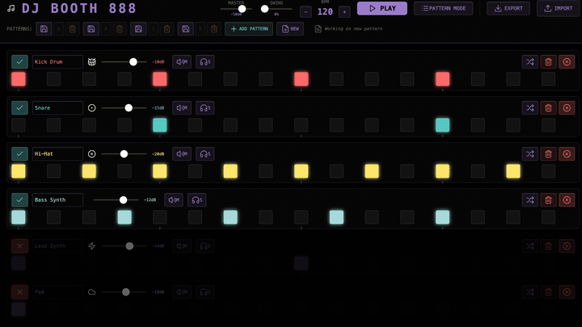

  
  
  <h1 align="center">MUSIC BUILDER</h1>
  <h3 align="center"> Tʜᴇ Sᴛᴇᴘ SᴇǫᴜᴇNᴄᴇʀ ᴀɴᴅ Sᴏɴɢ Aʀʀᴀɴɢᴇʀ </h3>

  <!-- TOP PURPLE LINKS -->
  
  
  
   
  <!-- BOTTOM GOLD TAXONOMY -->
  
  
  
  

  
<i>MUSIC BUILDER is a desktop digital audio workstation sequencer panel built as a native Datacore component, utilizing Tone.js to provide multitrack synthesis, real-time step triggering, and multi-pattern song arrangement.</i>

## Introduction

MUSIC BUILDER brings music composition capabilities to Obsidian vault environments. Structured around a 16-step modular sequencer grid, this component enables you to synthesize patterns, configure individual voice envelopes, and organize custom tracks into sectioned arrangements. Perfect for audio editing, loop layout planning, and in-workspace sound experiments.

## Features

### Runtime and Agentic Safety
- **Dynamic Watchdog Daemon**: Integrates a file-based command watcher loop that monitors `mcp_commands.json` for hot reloading.
- **Pane Reparenting**: Leverages full-tab DOM reparenting to expand and fill Obsidian panes dynamically, bypassing standard workspace container padding.
- **Memory Safeguards**: Automatic voice node cleanup and master volume release upon component disposal to avoid memory leaks.

### Security and Integrations
- **Sanitized Execution**: Strictly offline-capable instrument engine with local browser audio context APIs.
- **Scope Isolation**: Uses custom class anti-bleed scopes to prevent styling leakages into adjacent Obsidian panels.
- **Zero-Dependency Core**: Connects directly to Tone.js through runtime CDN scripting nodes, ensuring zero package overhead.

### User Interface and Developer Loop
- **Interactive 16-Step Sequencer Grid**: Multi-track rows with customizable accent colors, mutes, solos, and volume parameters.
- **Song Arranger**: A multi-section composition editor to chain and arrange patterns (A, B, C, D...) with specific loop repeating counts.
- **Import and Export Panel**: Export and download compositions as JSON schemas, or compile and export recorded audio as high-fidelity WebM tracks.

## Directory Index & Components

The package exposes the following files:

| File | Description |
| :--- | :--- |
| **[MUSIC BUILDER.md](MUSIC%20BUILDER.md)** | The main Obsidian leaf entry point loader query. |
| **[_RESOURCES/DATACORE/_DONE/MUSIC BUILDER/src/index.jsx](_RESOURCES/DATACORE/_DONE/MUSIC%20BUILDER/src/index.jsx)** | Entry bootstrapper hook that handles namespace imports and hot reloading. |
| **[_RESOURCES/DATACORE/_DONE/MUSIC BUILDER/src/App.jsx](_RESOURCES/DATACORE/_DONE/MUSIC%20BUILDER/src/App.jsx)** | Main coordinator component coordinating states, transport triggers, and arrangement editors. |
| **[src/components/Playhead.jsx](src/components/Playhead.jsx)** | Isolated UI timeline marker step playhead. |
| **[src/components/HeaderControls.jsx](src/components/HeaderControls.jsx)** | BPM, volume, swing, and import/export panel wrapper. |
| **[src/components/PatternBank.jsx](src/components/PatternBank.jsx)** | Preset slot manager to save, clear, and recall multitrack pattern states. |
| **[src/components/ArrangementEditor.jsx](src/components/ArrangementEditor.jsx)** | Multi-pattern arrangement timeline editor for song composition. |
| **[src/components/TrackRow.jsx](src/components/TrackRow.jsx)** | UI sequencer step grid, volume range knobs, and instrument selectors. |
| **[src/core/Instruments.js](src/core/Instruments.js)** | Synthesizer definition nodes and step note playing logic powered by Tone.js. |
| **[src/core/Styles.js](src/core/Styles.js)** | Encapsulated CSS layout tokens and visual style sheets. |
| **[METADATA.md](_RESOURCES/DATACORE/_DONE/MUSIC%20BUILDER/METADATA.md)** | Manifest YAML properties outlining compatibility, runtime parameters, and index categories. |
| **[CONTRIBUTION.md](_RESOURCES/DATACORE/_DONE/MUSIC%20BUILDER/CONTRIBUTION.md)** | Developer compilation guidelines and coding standards. |
| **[LICENSE.md](_RESOURCES/DATACORE/_DONE/MUSIC%20BUILDER/LICENSE.md)** | MIT permissive distribution license. |
